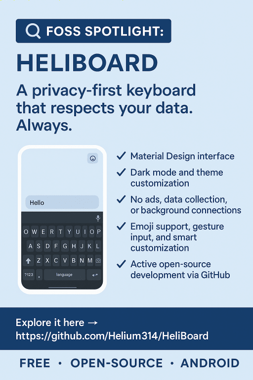

---
date:
  created: 2025-05-29
  updated: 2025-06-08
title: FOSS Spotlight - HeliBoard
summary:
  Say hello to HeliBoard – your privacy-first, open-source keyboard built just
  for Android!
authors:
  - team
categories:
  - Android
  - Open-Source
  - Privacy
tags:
  - foss-spotlight
  - open-source
  - privacy
  - android
  - heliboard
---

# 🔦 FOSS Spotlight: HeliBoard ⌨️

## Say hello to HeliBoard – your privacy-first, open-source keyboard built just for Android! 🚀

This sleek and lightweight keyboard doesn’t just look good—it respects your
data, <em>always</em>. No network permissions, no shady tracking, no unnecessary
bloat. HeliBoard is here for those who type with purpose AND privacy in mind. 🛡️

### 💡 Key Features

- Clean Material Design UI 🎨
- Built-in themes with dark mode support 🌙
- No ads, telemetry, or internet permissions 📵
- Emoji support, gestures, and customization 🙌
- Actively developed on GitHub – get involved! 🔧

<!-- more -->

Whether you're switching from Gboard or just want something more minimal and
ethical, **HeliBoard** brings you that true FOSS flavor while keeping your taps
smooth and secure.

📥 HeliBoard can be downloaded from the following links:  
GitHub: [github.com/Helium314/HeliBoard](https://github.com/Helium314/HeliBoard)  
F-Droid:
[f-droid.org/packages/helium314.keyboard/](https://f-droid.org/packages/helium314.keyboard/)

🛠️ Open-source. Lightweight. Transparent. HeliBoard isn’t just a keyboard—it's a
philosophy.

**Weekly FOSS gems like this remind us: we have powerful alternatives, built by
passionate devs, made for people who care. _Let's support that_.**

Got a favorite FOSS project? Let us know at `social (at) neteng.pro`, and we
might feature it next!

&nbsp;

<figure class="poster-figure">
  
  <figcaption>FOSS Spotlight: HeliBoard – featured visual</figcaption>
</figure>

<!--  -->
